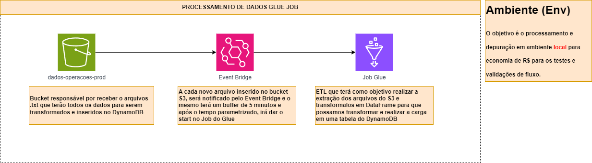
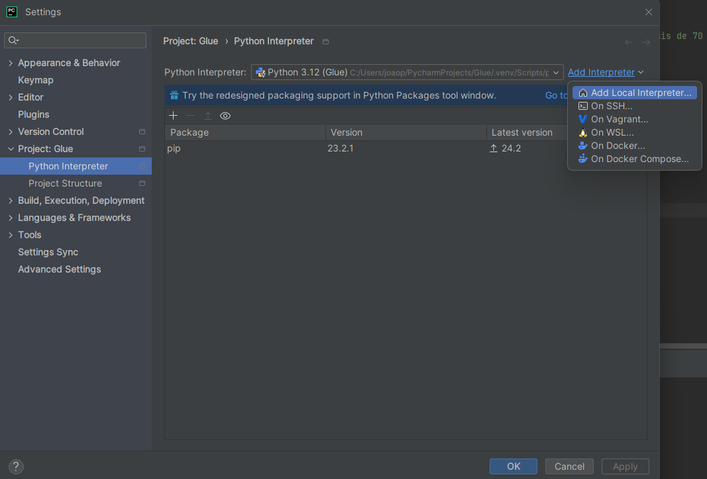
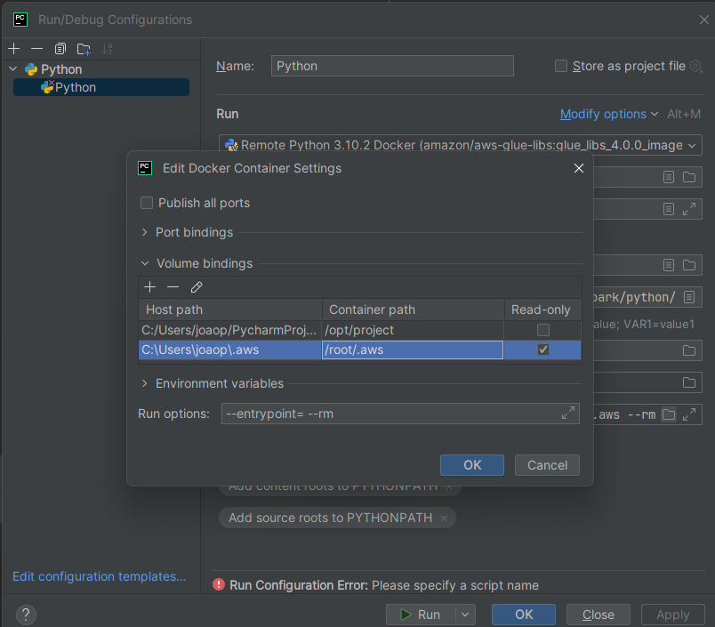
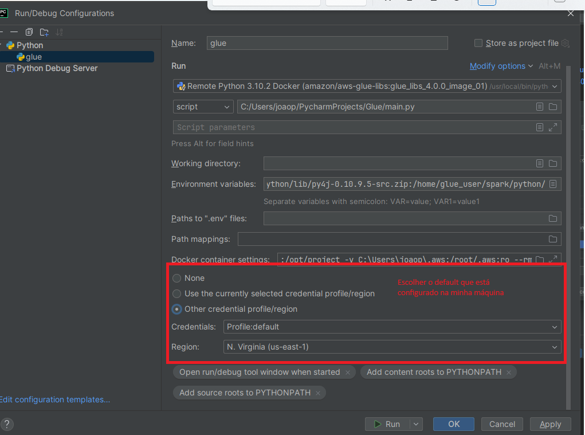
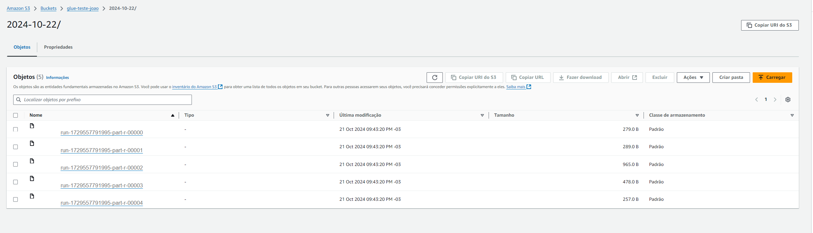
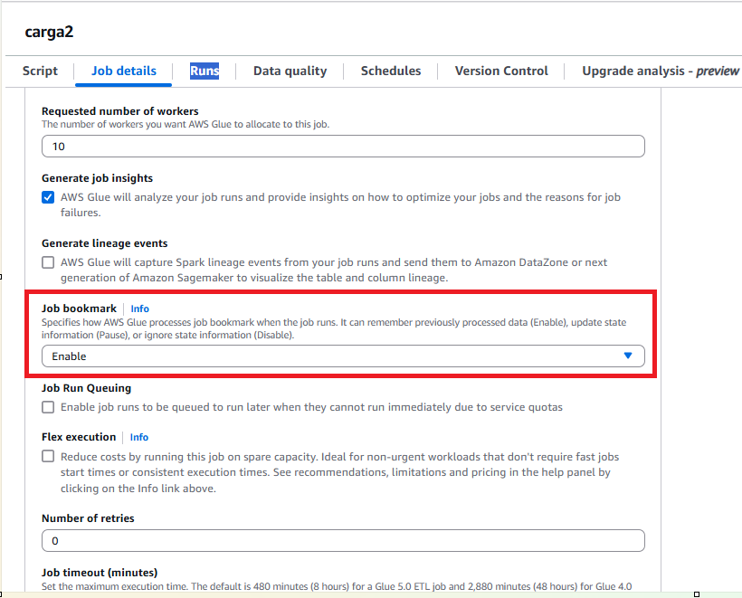
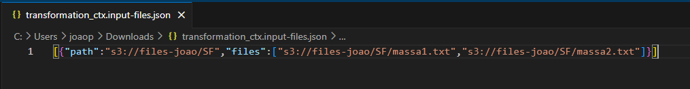
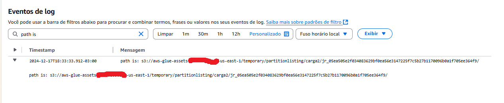
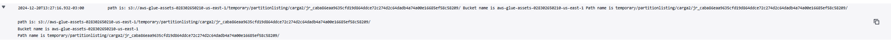

# Processamento de Dados com Glue Job

Projeto responsável por processamento de alto volume de dados de forma precisa, confiável e com baixo custo.
Utizaremos o AWS Glue para atingir nossos objetivos.

> O AWS Glue é um serviço de integração de dados com tecnologia sem servidor que torna a preparação de dados mais simples, rápida e barata. Você pode descobrir e se conectar a mais de 70 fontes de dados diversas, gerenciar seus dados em um catálogo de dados centralizado e criar, executar e monitorar visualmente pipelines ETL para carregar dados em seus data lakes.
> <br> Para mais informações acesse: https://aws.amazon.com/pt/glue/


> Fluxo funcional do ETL cujo objetivo é extrair dados de um bucket S3 e persistir os dados em um DynamoDB. O objetivo é o projeto rodar localmente




> Arquitetura Macro.

### Ajustes e melhorias

> O objetivo é rodar o Job do Glue localmente para economizar R$ nos testes e debugs.

Tarefas realizadas durante o desenvolvimento:

- [x] Configuração de infraestrutura
  - [x] Docker Desktop
  - [x] Python 3.10
  - [x] Variáveis de ambiente para o Python
  - [x] Configuração de localstack
- [x] Configurações do Docker
  - [x] Dowload da imagem do Glue e execução no Docker
  - [x] Settings > Ativar `Expose daemon on tcp://localhost:2375 without TLS`
- [x] Configurações de IDE
  -  [x] Download do Pycharm Professional
  - [x] Configuração do Pychar para executar Python Interpreter com Docker
- [x] Desenvolvimento 
  - [x] Criaçao do Script do Job do Glue para ETL
  - [x] Testes e validação dos dados processados 

## 💻 Pré-requisitos

Antes de começar, verifique se você atendeu aos seguintes requisitos:

- Você instalou o `Docker`
  - https://docs.docker.com/desktop/install/windows-install/
- Você instalou o Python 3.10
  - https://www.python.org/downloads/release/python-3100/
- Você baixou a imagem do Glue: `docker pull amazon/aws-glue-libs:glue_libs_4.0.0_image_01`
  - https://hub.docker.com/r/amazon/aws-glue-libs/tags
- Você possui o PyCharm Professional Instalado
  - https://www.jetbrains.com/pt-br/pycharm/
- Conta AWS configurada corretamente
  - Ajustar a pasta .aws com suas credenciais da AWS
- Instalar o AWS Tool Kit no Pycharm
  - https://aws.amazon.com/pt/pycharm/
- Instalar o localstack 
  - https://www.localstack.cloud/

## 💻 Como configurar o Pycharm?

- Settings > Python Interpreter
  - 

- Acessar e clonar o projeto: https://github.com/awslabs/aws-glue-libs

- Settings > Project Structure > Add Content Root > `adicionar pasta clonada`

- Adicionar as variáveis de ambiente no PyCharm:
  - Add `PYTHONPATH` :https://hub.docker.com/layers/amazon/aws-glue-libs/glue_libs_4.0.0_image_01/images/sha256-668ca72bcb44e73111dfe25eb42a9e29938221d7c71429a35ed576a8c13407ba?context=explore

- Configurar credentias AWS to container Glue
  - 
  - 
  
- Configurar seu código para acessar a AWS local através do localstack
  - Alterar o sparkSession: https://stackoverflow.com/questions/71973940/glue-to-connect-localstack-s3
    - hadoop_conf.set("fs.s3a.impl", "org.apache.hadoop.fs.s3a.S3AFileSystem")
    - hadoop_conf.set("fs.s3a.path.style.access", "true")
    - hadoop_conf.set("fs.s3a.connection.ssl.enabled", "false")
    - hadoop_conf.set("com.amazonaws.services.s3a.enableV4", "true")
    - hadoop_conf.set("fs.s3a.aws.credentials.provider", "org.apache.hadoop.fs.s3a.TemporaryAWSCredentialsProvider")
    - hadoop_conf.set("fs.s3a.access.key", "mock")
    - hadoop_conf.set("fs.s3a.secret.key", "mock")
    - hadoop_conf.set("fs.s3a.session.token", "mock")
    - hadoop_conf.set("fs.s3a.endpoint", "http://localhost:4566")
  
## 💻 Explicando o Código

 - Extraindo os dados de um bucket do S3
 - Processar os dados criando novas colunas
 - Inserindo os dados no DynamoDB
  
## 💻 Exemplo do load completo




## 💻 Deploy job do Glue

- Para subir o Job no Glue é preciso realizar o empacotamento para distribuição dos pacotes/módulos
  - Criar arquivo setup.py
  - Executar comando `python setup.py bdist_wheel`

Após a criação do pacote já estamos prontos para irmos para cloud AWS e executar nosso JOB.


## 💻 Como recuperar os dados já consumidos?

- Para consumir os dados é necessário ativar o job bookmark e definir um path de arquivos temporários
- 
- Após ativar todos os arquivos já processados estarão salvos no bucket temporário
- 
- Para encontrar o path do caminho temporario é somente usar a função no aws adapter
- 

## 💻 Como mover os arquivos já processados?

- Primeiro precisamos encontrar os caminhos necessários
- 


## 💻 Democratização

- Criar o database e tabelas no Glue Data Catalog
- Adicionar nova propriedade da tabela para que possa criar as novas particições
  - useGlueParquetWriter: true
  3 - Adicionar código
```python
glue_context.write_dynamic_frame_from_catalog(
    frame=dynamicFrame,
    database="database",
    table_name ='table_name',
    transformation_ctx = "write_sink",
    additional_options={
        "enableUpdateCatalog": True,
        "updateBehavior": "LOG",
        "partitionKeys":  ["data_versao", "id_carga"],
        "compression": "snappy"
    }
)
```
- Documentação: https://docs.aws.amazon.com/glue/latest/dg/update-from-job.html
- OBS: As partitions keys precisam estar na mesma ordem no schema da tabela
 
## 🤝 Colaboradores

Agradecemos às seguintes pessoas que contribuíram para este projeto:

<table>
  <tr>
    <td align="center">
      <a href="#" title="defina o título do link">
        <br>
        <sub>
          <b>João Pedro Amaral Souza</b>
        </sub>
      </a>
    </td>
  </tr>
</table>
